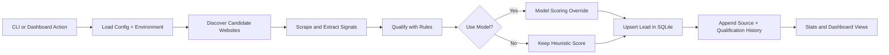

# Lead Agent

This project explores how AI-assisted workflows and orchestration systems can automate repetitive research and operational tasks using structured multi-step processes.


## Why This Exists
Many lead and research tools are expensive, rigid, or hard to inspect. Lead Agent is a local-first alternative for testing and operating practical automation workflows.

It is designed to help with:
- repeatable lead research
- transparent qualification logic
- auditable operational runs
- quick iteration on niche-specific workflows

## Workflow Diagram


Pipeline summary:
`CLI/Dashboard -> Discovery -> Scrape -> Qualification -> SQLite -> Dashboard`

## Practical Use Cases
- Lead qualification for outbound prospecting
- Research automation for niche market mapping
- Internal reporting on discovered vs qualified opportunities
- Workflow routing by score band (`Hot`, `Warm`, `Cold`, `Unscored`)
- CRM enrichment preparation from website signals
- Operational dashboards for local review and reruns

## What It Does
- Discovers candidate businesses from niche query sets
- Extracts website metadata and contact signals (email, phone, content)
- Scores and bands each lead with deterministic rules
- Optionally applies model-based scoring through API-compatible providers
- Stores canonical lead state plus append-only history in SQLite
- Runs from CLI and a local dashboard

## Technical Overview
Core modules:
- `src/lead_agent/cli.py`: command entrypoints
- `src/lead_agent/pipeline.py`: run orchestration
- `src/lead_agent/discovery.py`: website discovery
- `src/lead_agent/scrape.py`: fetch and signal extraction
- `src/lead_agent/qualify.py`: rule-based scoring
- `src/lead_agent/model.py`: optional model scoring adapters
- `src/lead_agent/db.py`: schema, upserts, history, run telemetry
- `src/lead_agent/dashboard.py`: local web interface and actions

## Quick Start
```bash
python3 -m venv .venv
source .venv/bin/activate
pip install -e .
cp .env.example .env
```

## Terminal Examples
Initialize DB:
```bash
PYTHONPATH=src ./.venv/bin/python -m lead_agent.cli init-db --db data/leads.db
```

Import CSV:
```bash
PYTHONPATH=src ./.venv/bin/python -m lead_agent.cli import-csv <path-to-csv> --db data/leads.db
```

Run one discovery cycle:
```bash
PYTHONPATH=src ./.venv/bin/python -m lead_agent.cli run --config config/niches.example.json
```

Requalify leads:
```bash
PYTHONPATH=src ./.venv/bin/python -m lead_agent.cli requalify --db data/leads.db --config config/niches.example.json
```

Start dashboard:
```bash
PYTHONPATH=src ./.venv/bin/python -m lead_agent.cli ui --db data/leads.db --config config/niches.example.json --host 127.0.0.1 --port 1617
```

Open: `http://127.0.0.1:1617`

## Current Limitations
This project is experimental and currently focused on orchestration logic and workflow design rather than production deployment.

Known constraints:
- Discovery depends on third-party search/page availability
- Some sites block scraping or hide contact data
- Model output reliability varies by provider and prompt shape
- No formal automated test suite yet
- Run behavior can vary significantly by network environment

## What I Learned
- Prompt reliability is strongly tied to strict output validation
- Orchestration complexity grows quickly once retries, fallbacks, and history are added
- Structured processing is more reliable than free-form agent behavior for repeatable tasks
- API and provider differences require defensive adapters and clear failure paths
- Operational bottlenecks usually appear in discovery quality and scrape success rates

## Tech Stack
- Python 3.10+
- SQLite
- HTTP + HTML parsing
- Optional model providers (`openai`, `venice`, `openrouter`)

## Environment Variables
- `OPENAI_API_KEY`
- `LEAD_AGENT_MODEL_API_KEY`
- `LEAD_AGENT_USE_MODEL`
- `LEAD_AGENT_MODEL`
- `LEAD_AGENT_MODEL_PROVIDER`
- `LEAD_AGENT_MODEL_TIMEOUT_SECONDS`
- `LEAD_AGENT_DOTENV_PATH`

## License
Add your preferred open-source or private license in this repository.
