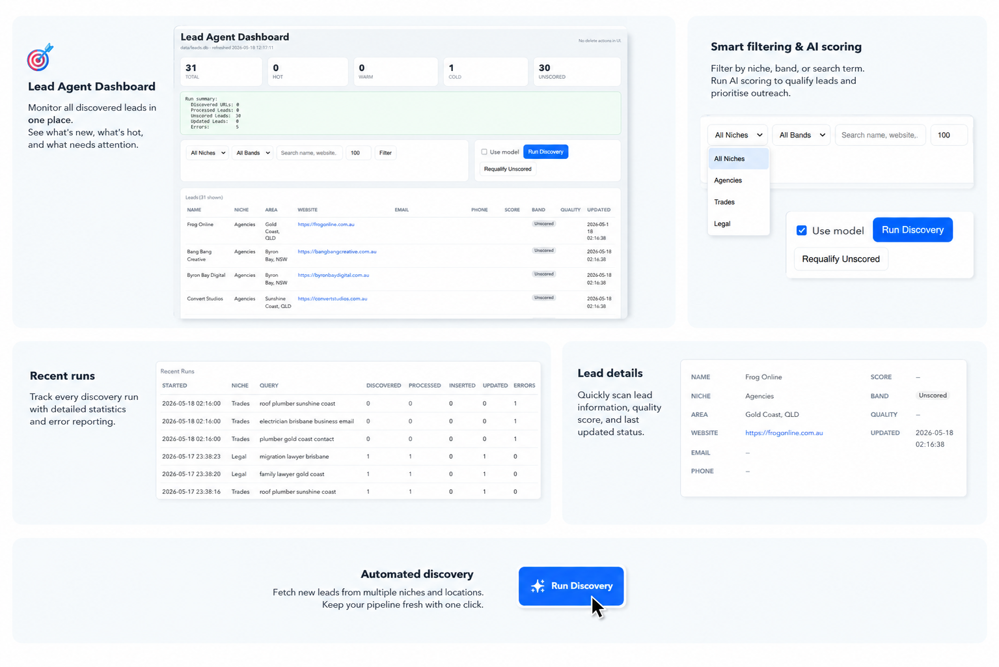

# Lead Agent

Local-first lead generation pipeline and dashboard for discovering businesses, extracting contact signals, qualifying opportunities, and tracking every run with auditable history in SQLite.



## Why This Project Exists
Prospecting tools are often expensive, opaque, and difficult to customize. Lead Agent is built to solve that by giving you:
- Full control over your lead criteria and scoring logic
- A local, inspectable data pipeline (no black box vendor lock-in)
- Fast iteration on niche queries, qualification policy, and outreach prioritization

## What It Does
- Discovers candidate businesses from niche-specific search queries
- Scrapes website metadata and contact signals (email, phone, content context)
- Qualifies each lead into `Hot`, `Warm`, `Cold`, or `Unscored`
- Optionally uses an LLM scorer (OpenAI/OpenRouter/Venice-compatible)
- Persists canonical lead state plus append-only source and qualification history
- Exposes a local dashboard for filtering, discovery runs, and requalification actions

## Architecture At A Glance
`CLI -> Discovery -> Scrape/Extract -> Heuristic + Optional Model Scoring -> SQLite -> Dashboard`

Core modules:
- `src/lead_agent/cli.py`: command surface and orchestration entrypoints
- `src/lead_agent/pipeline.py`: single-query run execution and metrics aggregation
- `src/lead_agent/discovery.py`: web discovery source integration
- `src/lead_agent/scrape.py`: fetch + page signal extraction
- `src/lead_agent/qualify.py`: deterministic qualification logic
- `src/lead_agent/model.py`: model-based scoring adapters with fallback
- `src/lead_agent/db.py`: schema, upserts, run telemetry, qualification history
- `src/lead_agent/dashboard.py`: local UI and action endpoints

## Engineering Highlights
- Local-first design: all core data in SQLite for portability and ownership
- Auditability: append-only `lead_sources` and `lead_qualifications`
- Safe operations: no destructive delete flow in pipeline or dashboard actions
- Practical resilience: model scoring gracefully falls back to heuristics on errors
- Operational UX: discovery/requalify can run from both CLI and web dashboard

## Tech Stack
- Python 3.10+
- SQLite
- HTML parsing + HTTP scraping pipeline
- Optional LLM providers via API-compatible adapters

## Quick Start
```bash
python3 -m venv .venv
source .venv/bin/activate
pip install -e .
cp .env.example .env
```

## Run It
Initialize the database:
```bash
PYTHONPATH=src ./.venv/bin/python -m lead_agent.cli init-db --db data/leads.db
```

Import leads from CSV:
```bash
PYTHONPATH=src ./.venv/bin/python -m lead_agent.cli import-csv <path-to-csv> --db data/leads.db
```

Run discovery once:
```bash
PYTHONPATH=src ./.venv/bin/python -m lead_agent.cli run --config config/niches.example.json
```

Requalify unscored leads:
```bash
PYTHONPATH=src ./.venv/bin/python -m lead_agent.cli requalify --db data/leads.db --config config/niches.example.json
```

Launch dashboard:
```bash
PYTHONPATH=src ./.venv/bin/python -m lead_agent.cli ui --db data/leads.db --config config/niches.example.json --host 127.0.0.1 --port 1617
```
Open `http://127.0.0.1:1617`.

## Dashboard Capabilities
- KPI cards: total leads + band distribution
- Filters: niche, band, free-text query, row limits
- Actions: `Run Discovery`, `Requalify Unscored`, optional `Use model`
- Leads table with qualification and freshness fields
- Recent runs table with operational metrics and errors

## Data Model
Main tables:
- `leads`: canonical current lead state
- `lead_sources`: append-only source lineage
- `lead_qualifications`: append-only score/band snapshots
- `scrape_runs`: per-query telemetry and error counts

## Environment Variables
- `OPENAI_API_KEY`: default model key
- `LEAD_AGENT_MODEL_API_KEY`: preferred model key override
- `LEAD_AGENT_USE_MODEL`: `true/false`
- `LEAD_AGENT_MODEL`: model ID
- `LEAD_AGENT_MODEL_PROVIDER`: `openai`, `venice`, or `openrouter`
- `LEAD_AGENT_MODEL_TIMEOUT_SECONDS`: request timeout
- `LEAD_AGENT_DOTENV_PATH`: default dotenv path

## Suggested Demo Script (For Interviews)
1. Import a small CSV and show `stats` before/after.
2. Run one discovery cycle and explain telemetry (`discovered`, `processed`, `errors`).
3. Requalify unscored leads with and without model mode.
4. Open dashboard and filter by niche/band to show prioritization workflow.
5. Explain append-only audit history and why it matters for trust/debugging.

## Project Scope And Limitations
- Discovery quality depends on third-party search/page availability.
- Some websites block scraping or hide contact signals.
- LLM output may vary by provider/model quality.
- No automated test suite yet (recommended next step).

## Roadmap (High-Value Next Steps)
- Add unit tests for normalization, scoring thresholds, and DB upsert behavior
- Add retries/backoff + richer scrape error categorization
- Add export actions (`Hot/Warm` segments) for outreach workflows
- Add confidence scoring and duplicate clustering by domain/entity similarity

## License
Add your preferred open-source or private license in this repository.
